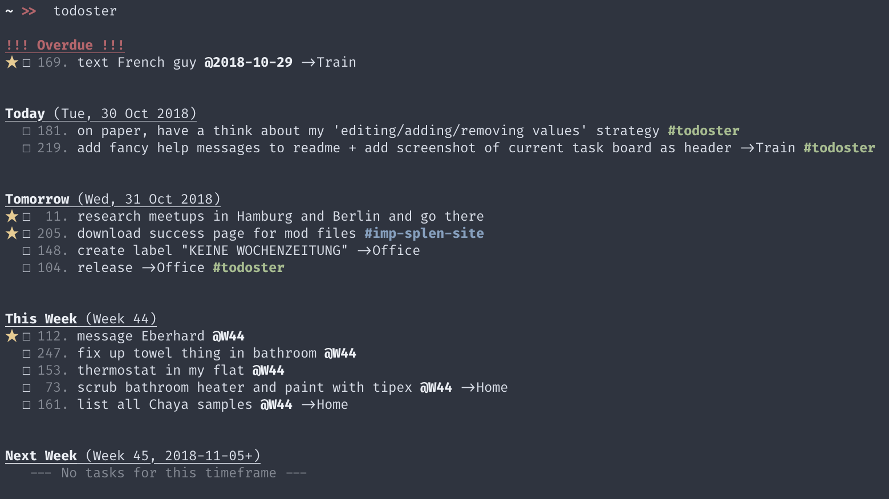

# todoster
> A simple command line todo list

[](https://github.com/sophieau/todoster/releases)
[](https://pypi.python.org/pypi/todoster)

[](https://github.com/SophieAu/todoster/issues)
[](https://github.com/SophieAu/todoster/blob/master/LICENSE)




[Features](#features) | [Installation](#installation) | [Usage](#usage) | [Troubleshooting](#troubleshooting) | [Similar Apps](#similar-apps)

## Features

todoster is conciously kept simple. For other, potentially more feature rich apps, check out [similar apps](#similar-apps) below.

Nevertheless, it does have _some_ features:

* **Manage Tasks:** Like any good todo app, todoster lets you add, edit, complete and delete tasks. Tasks can have a due date and a location, as well as be high priority and belong to a project.
* **Manage Projects:** Projects are color coded and can be assigned tasks. Projects can also be archived if e.g. they are completed.
* **Different Todo List Views:** You can have your tasks displayed by due date, project and location, as well as choose to display only the tasks for the next two weeks and tasks without a due date.

Features I conciously chose not to have:
* recurring tasks
* statistics
* "version history" of tasks


## Installation

todoster is available on [PyPI](https://pypi.python.org/pypi/todoster). This is the easiest way to install it. All dependencies will be installed automatically.

```sh
pip install todoster
```


## Usage
```
USAGE
    $ todoster [COMMAND]

COMMANDS
    None        display default todo list
    task, t     manage tasks
    project, p  manage projects
    show, s     display todo lists
```

todoster creates a `.todoster` folder in your home directory (`~/`) where it saves all tasks and projects. If you want to specify a different folder for these files, you need to set the `TODOSTER_DIR` in your `.bashrc` like so:

    export TODOSTER_DIR=/path/that/you/want

### Managing Tasks
```
USAGE
    $ todoster task [COMMAND]

COMMANDS
    add          add a task
    edit [ID]    edit a task
    check [ID]   mark a task as completed/not completed
    delete [ID]  delete a task

ARGUMENTS
    ID  id of the task

OPTIONS (add and edit only)
    -t/--title [TITLE]        set title
    -d/--date [DATE]          set due date
    -p/--project [SHORTCODE]  set project
    -l/--location [LOCATION]  set location
    -i/--important            mark task as important

EXAMPLES
    $ todoster task add -t "new task" -d 10.12.2018 -l "Office"
    $ todoster task edit 23 -d 15.12.2018
    $ todoster task edit 23 -i
    $ todoster task check 23
    $ todoster task delete 23
```
### Managing Projeccts
```
USAGE
    todoster project [COMMAND]

COMMANDS
    l, list [-a/--all]      list projects (incl. archived if -a flag is set)
    a, add                  create project
    e, edit [SHORTCODE]     edit project
    c, archive [SHORTCODE]  archive project
    d, delete [SHORTCODE]   delete project and all associated tasks

ARGUMENTS
    SHORTCODE  shortcode of the project

OPTIONS (add and edit only)
    -t/--title [TITLE]          set title
    -s/--shortcode [SHORTCODE]  set shortcode
    -c/--color [COLOR]          set color

VALID COLOR VALUES
    default
    grey
    red
    green
    yellow
    blue
    purple
    cyan
    white

EXAMPLES
    $ todoster project add -t "React Website Tutorial" -s react-tute -c green
    $ todoster project edit react-tute -c purple
    $ todoster project archive react-tute
    $ todoster project delete react-tute
    $ todoster project list -a
```

### The Different List Views
```
USAGE
    todoster show [COMMAND]

COMMANDS
    current   show tasks due in this or the next week
    backlog   show tasks without a due date
    date      show tasks grouped by week
    location  show tasks grouped by location
    priority  show tasks grouped by priority
    project   show tasks grouped by project

OPTIONS
    -a, --all      show tasks belonging to archived projects
    -c, --checked  show checked tasks with no due date or a due date in the future
    -p, --past     show checked tasks with a due date in the past (only works in combination with -c)
```


## Troubleshooting

#### Bug Reports and Feature Requests
Bug reports and feature requests are very much appreciated. Please contact me on Twitter ([@SolviAu](https://twitter.com/solviau)) or open an issue [here](https://github.com/SophieAu/todoster/issues/new).


## Similar Apps
The app was originally inspired by [taskbook](https://github.com/klauscfhq/taskbook). Other cli apps I found are:
* [committask](https://github.com/ZeroX-DG/CommitTasks)
* [td](https://github.com/Swatto/td)

---
> [sophieau.github.io](https://sophieau.github.io) – Twitter [@SolviAu](https://twitter.com/solviau) – © 2018, [MIT Licence](LICENSE)